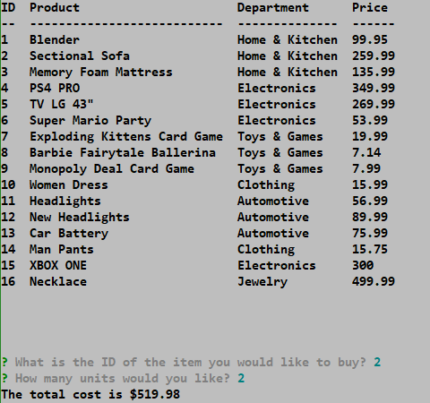

# bAmazon - CLI App
***
## Description  
Command Line Amazon-like storefront with MySQL
***

## Libraries
   * [Inquirer](https://www.npmjs.com/package/inquirer)
   * [MySQL](https://www.npmjs.com/package/mysql)
   * [Console Table](https://www.npmjs.com/package/console.table)

***
## Notes

* There are 3 apps: Customer, Manager & Supervisor
* Customer can only buy
  *  To run the app type "node bAmazonCustomer"
   > 
  *  There are only 2 choices, Buy or Exit
   >   
  *  **Buy** 
  *  The complete list of items on the Database will be display, ID & Units to buy are going to be requested.
   >   

* Supervisor can check the sales by department and create new departments
  *  To run the app type "node bAmazonSupervisor"
   > 
  *  There are 3 choices
   >  
  * **View Product Sales by Department**
  *  A table with the Total Profit by Department will be displayed
  >  
  * **Create New Department** 
  *  The name for the new department will be asked, if it already exist, it won't be created.
  >   

***